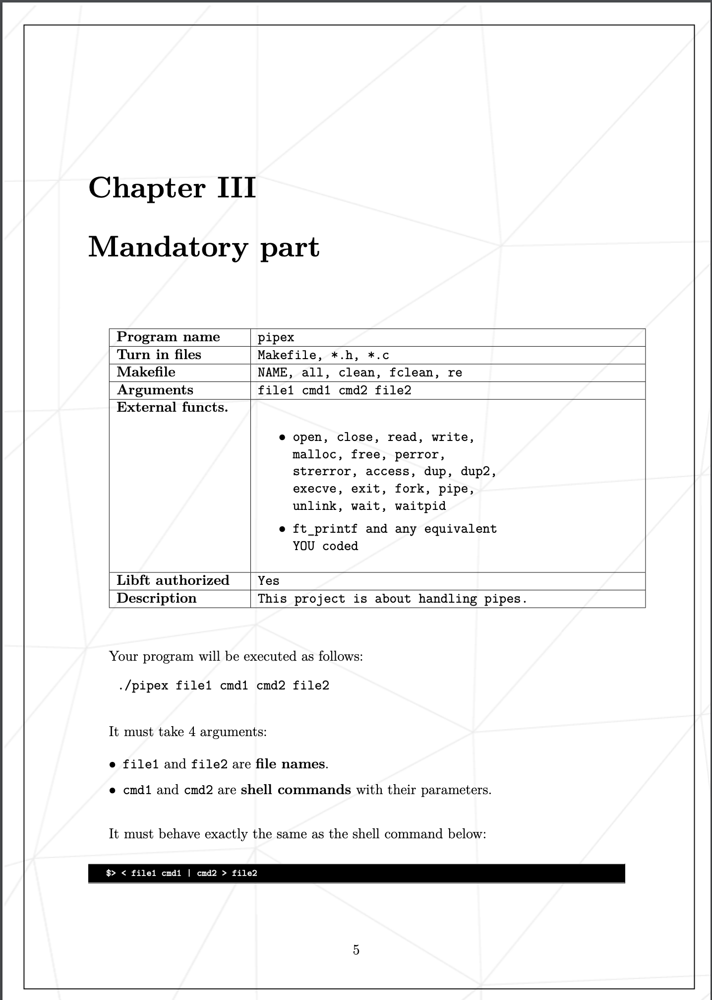
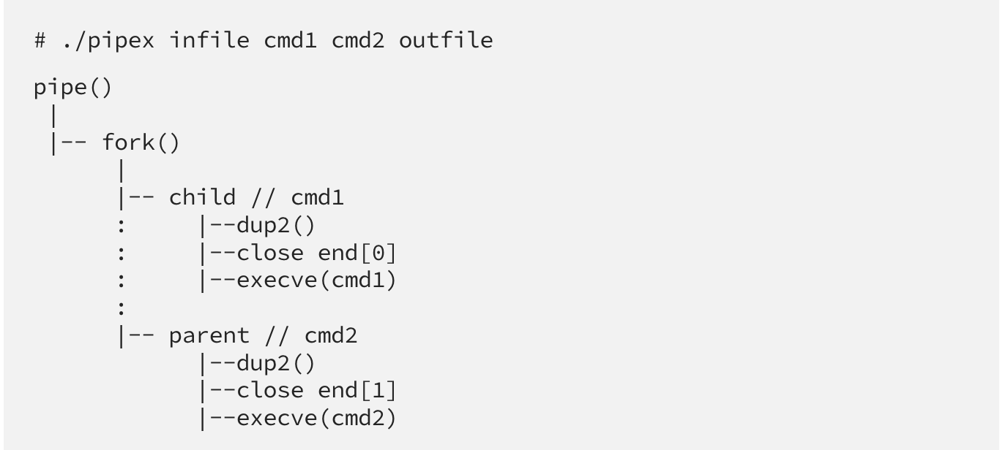

## Pipex project in 42 Ecole


This project is to  discover in detail a UNIX mechanism - *PIPE* by implementing it.


## Requirements




How to use:
```bash
  ./pipex infile cmd1 cmd2 outfile
```
where:
-  infile - file that is used as *stdin* for first shell command
-  cmd1 and cmd2 - valid shell commands with necessary flags
-  outfile - file that is used to write result to

## Implementation



The general idea: we read from *infile*, execute *cmd1* with infile as input, send the output to *cmd2*, which will write to outfile.
**pipe()** sends the output of the first **execve()** as input to the second **execve()**; **fork()** runs two processes (i.e. two commands) in one single program; **dup2()** swaps our files with stdin and stdout.

